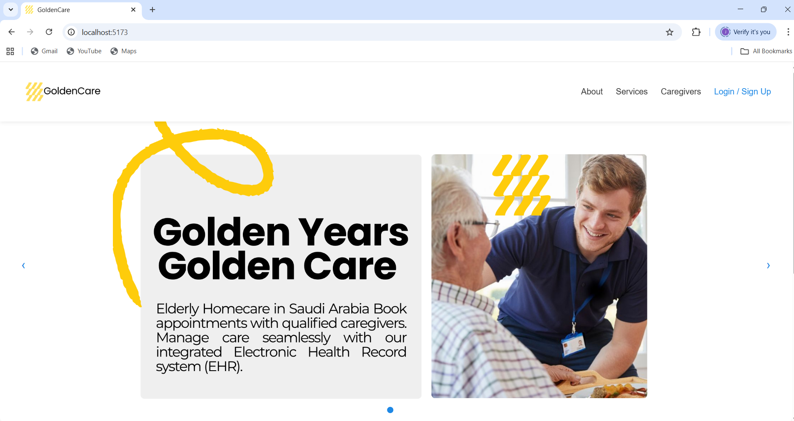
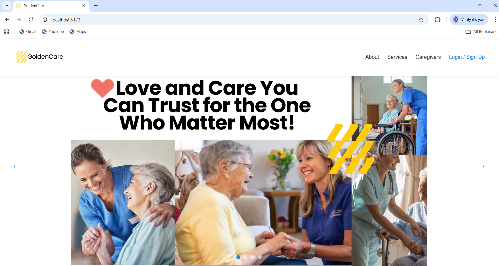
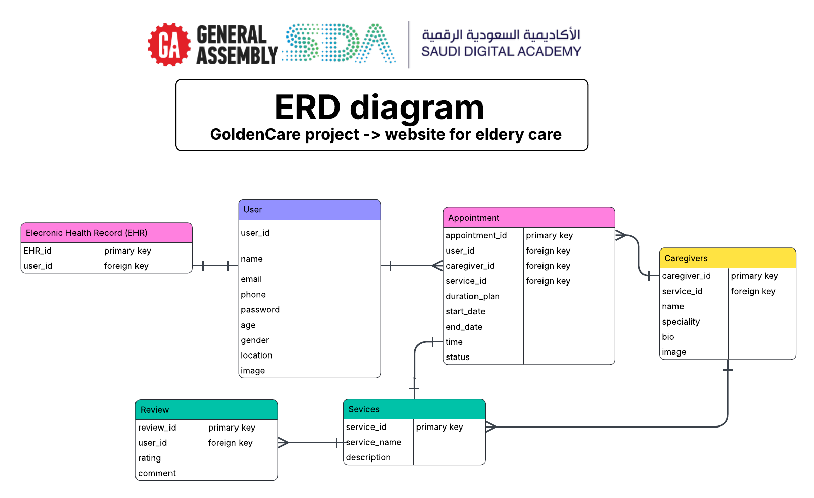

<p align="center">
  <a href="https://generalassemb.ly/">
    
  <a href="https://sda.edu.sa/">
  </a>
</p>

# GoldenCare Frontend
### Backend Repository    [GoldenCare Backend](https://github.com/RaghadAlbeladi1/GoldenCare-backend)
### Frontend link [ColdenCare](http://localhost:5173/)
## Project Description

GoldenCare is a comprehensive platform connecting families and caregivers to provide home-based senior care. The frontend provides an intuitive user interface for families to browse services, book caregiver appointments, manage health records, and interact with the GoldenCare ecosystem seamlessly. Built with modern React, the application offers a responsive and user-friendly experience for managing senior care needs.              <div align="center">
  
</div>  
  

## Repository Description

This repository contains the React frontend application for GoldenCare. The application provides a single-page application (SPA) interface for users to interact with the GoldenCare backend API, featuring authentication, service browsing, appointment management, and electronic health record viewing.

## Tech Stack

- **Framework**: React 19.1.1
- **Routing**: React Router DOM 7.9.4
- **Build Tool**: Vite 7.1.7
- **Language**: JavaScript (ES6+)
- **Styling**: CSS3
- **Development Tools**:
  - ESLint (Code linting)
  - Vite Plugin React (Fast refresh)

## Frontend Site

**Local Development**: `http://localhost:5173`

**Live Site**: (Deployment URL if available)

## Installation Instructions

### Using Docker (Recommended)

1. **Prerequisites**:
   - Docker Desktop installed and running
   - Docker Compose installed (included with Docker Desktop)

2. **Clone the repository**:
   ```bash
   git clone https://github.com/RaghadAlbeladi1/GoldenCare-frontend.git
   cd GoldenCare-frontend
   ```
    <div align="center">
  
</div> 

3. **Navigate to project root** (where docker-compose.yml is located):
   ```bash
   cd ../capstone-project
   ```

4. **Build and run containers**:
   ```bash
   docker-compose up --build
   ```

5. **Access the application**:
   - Frontend: `http://localhost:5173`
   - Backend API: `http://localhost:8000`

6. **View logs**:
   ```bash
   docker-compose logs -f frontend
   ```

7. **Stop containers**:
   ```bash
   docker-compose down
   ```

8. **Stop and remove volumes** (clean database):
   ```bash
   docker-compose down -v
   ```

### Manual Installation (Without Docker)

1. **Install dependencies**:
   ```bash
   npm install
   ```

2. **Run development server**:
   ```bash
   npm run dev
   ```

3. **Build for production**:
   ```bash
   npm run build
   ```

4. **Preview production build**:
   ```bash
   npm run preview
   ```

## RESTful Routing Table

<details open>


| Path | Component | Description |
|------|------------|-------------|
| `/` | `HomePage` |  shows welcome info, services preview, and call to action. |
| `/about` | `AboutPage` | About the app – explains mission, goals, and elderly care support. |
| `/services` | `ServicesPage` | Displays all available services with filtering/search options. |
| `/services/:id` | `ServiceDetailsPage` | Shows details for one specific service (linked to caregiver). |
| `/caregivers` | `CaregiversPage` | Lists all caregivers. |
| `/caregivers/:id` | `CaregiverDetailsPage` | Shows caregiver profile and linked services. |
| `/appointments` | `AppointmentsPage` | Lists, creates, edits, and manages appointments for logged-in user. |
| `/ehr` | `EHRPage` | Displays patient's health records, notes, and medications. |
| `/login` | `LoginPage` | User login page. |
| `/register` | `RegisterPage` | Registration for new users. |
| `/profile` | `ProfilePage` | Displays and allows editing of user profile. |
</details>

### ERD Diagram w/ three models, User Model, & Relationships

- user model, appointmet mode (CRUD),Reviews (CRUD), Caregivers, Electronic Health Record(EHR)

<div align="center">
  
</div>

## User Stories

<details open>


| # | Role | Task |
|---|------|------|
| 1 | As a **user** | I want to **sign up** for an account |
| 2 | As a **user** | I want to **login** to my account |
| 3 | As a **user** | I want to **logout** from my account |
| 4 | As a **user** | I want to **view** my profile information |
| 5 | As a **user** | I want to **update** my profile information |
| 6 | As a **user** | I want to **delete** my account |
| 7 | As a **user** | I want to **view all** available services |
| 8 | As a **user** | I want to **view** service details |
| 9 | As a **user** | I want to **search** for services by name |
| 10 | As a **user** | I want to **view all** available caregivers |
| 11 | As a **user** | I want to **view** caregiver details |
| 12 | As a **user** | I want to **book** an appointment |
| 13 | As a **user** | I want to **choose duration** (day/month/3 months) when booking |
| 14 | As a **user** | I want to **select date and time** for my appointment |
| 15 | As a **user** | I want to **view all** my appointments |
| 16 | As a **user** | I want to **view** my current active appointment |
| 17 | As a **user** | I want to **view** my appointment history |
| 18 | As a **user** | I want to **update** my appointment details |
| 19 | As a **user** | I want to **add notes** to my appointment |
| 20 | As a **user** | I want to **cancel** my appointment |
| 21 | As a **user** | I want to **mark** my appointment as completed |
| 22 | As a **user** | I want to **add** a medical note |
| 23 | As a **user** | I want to **add** medication information |
| 24 | As a **user** | I want to **view all** my health records |
| 25 | As a **user** | I want to **view** only my notes |
| 26 | As a **user** | I want to **view** only my medications |
| 27 | As a **user** | I want to **update** my health records |
| 28 | As a **user** | I want to **delete** a health record |
| 29 | As a **user** | I want to **view all** public reviews |
| 30 | As a **user** | I want to **write** a review after completing service |
| 31 | As a **user** | I want to **rate** my experience (1-5 stars) |
| 32 | As a **user** | I want to **write comment** about my experience |
| 33 | As a **user** | I want to **view** my own reviews |
| 34 | As a **user** | I want to **delete** my reviews |

#### Review 
- User can write review **ONLY after completing service**
- Reviews will apear for all **visitors in public page**
- Rating with **1-5 stars** and write **comments and feedback**

</details>

## IceBox Features

Features planned for future implementation:

- Community Forum: Platform for families to connect, ask questions about best doctors, share experiences, and support each other
- Virtual Clinic: Virtual consultation interface for remote healthcare visits
- Advanced Devices Marketplace: Browse and request advanced medical devices, integrated with contracted caregivers
- Emergency Response System: One-tap emergency button with instant alerts to caregivers and medical professionals
- IoT Integration Dashboard: Real-time monitoring interface for connected IoT health devices
- AI Health Assistant: Chat-based AI agent to answer health questions and provide recommendations
- Comprehensive Health Dashboard: Real-time monitoring dashboard for families to track health metrics, appointments, and care status
- Enhanced UI/UX: Modern design system with animations and transitions optimized for elderly users
- Mobile App: Native mobile applications for iOS and Android
- Dark Mode: Theme switcher for better accessibility
- Real-time Notifications: In-app notifications for appointments and updates
- Dashboard Analytics: Visual analytics for appointment history and service usage
- Advanced Search: Filter and search services with multiple criteria
- Chat Integration: Direct messaging between families and caregivers
- Calendar View: Visual calendar interface for appointment management
- Location Services: Map integration for finding nearby caregivers
- Image Upload: Upload profile pictures and document images
- Internationalization: Multi-language support (Arabic/English)
- Progressive Web App: PWA capabilities for offline functionality
- Onboarding Tutorial: Interactive guide for new users
- Usage Statistics: Personal dashboard with service usage insights
- HL7 Integration: Health Level Seven (HL7) standard integration for seamless interoperability with hospitals, clinics, and other healthcare systems. HL7 enables standardized data exchange of patient records, lab results, prescriptions, and clinical documents, ensuring compatibility and secure communication between GoldenCare platform and external healthcare providers
- Comprehensive Patient Records: Progress notes, vitals tracking, and complete integrated patient information dashboard for holistic care management
- AI Medical Coder Agent: Intelligent AI agent for medical coding that accurately writes medical codes, calculates insurance claims, and ensures proper billing documentation
- Vitals Monitoring Interface: Real-time tracking and visualization of patient vital signs with historical data analysis
- Progress Notes System: Digital documentation interface for patient care progress, treatment updates, and medical observations

